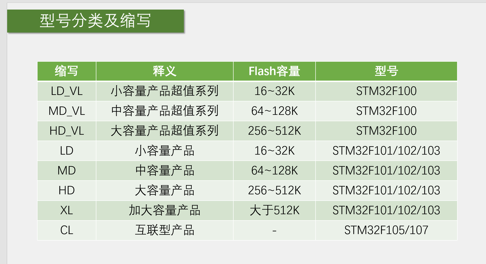
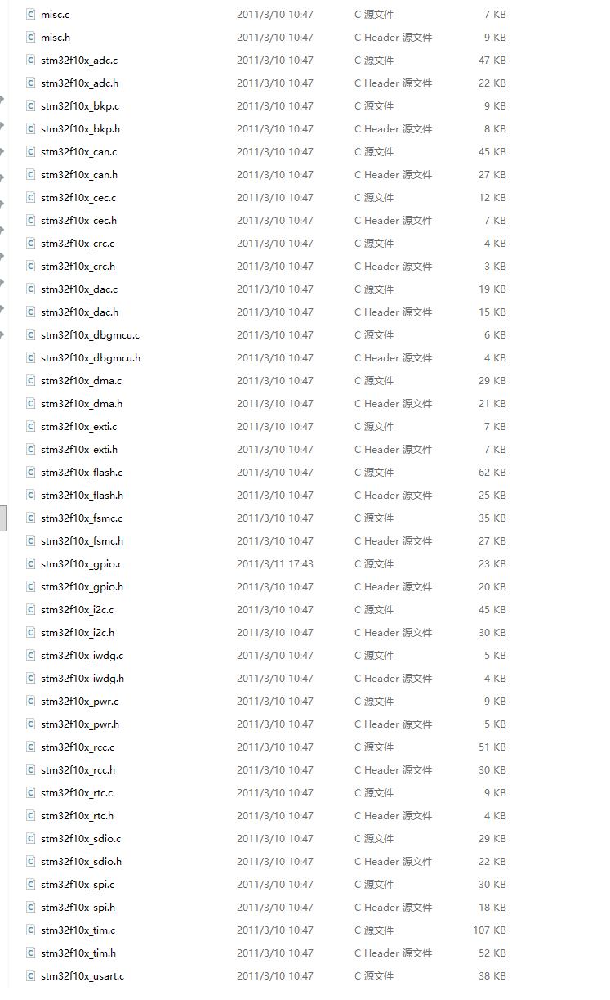
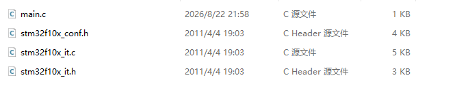
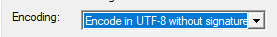
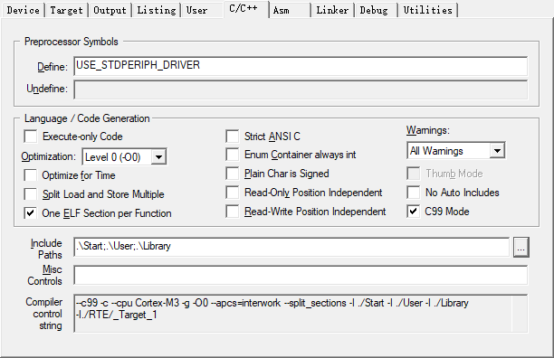
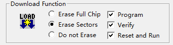

# STM32 Keil 开发环境搭建与工程配置教程

本文档基于江协科技提供的stm32教程文件来进行对 **STM32F103C8T6** + **Keil MDK**（ARMCC 编译器）的配置，详细介绍从零开始搭建一个标准外设库（StdPeriph Lib）工程的全过程，并附带 **VSCode + Keil Assistant** 的配置方法。

---

## 1. 添加启动文件（Startup）

启动文件是 STM32 程序执行的**第一步**，负责初始化堆栈、中断向量表，并跳转到 `main()` 函数。

### 1.1 文件位置

启动文件存放在固件库的以下路径：
...\Libraries\CMSIS\CM3\DeviceSupport\ST\STM32F10x\startup\arm

### 1.2 如何选择正确的启动文件？

不同型号的 STM32 芯片，**Flash 容量不同**，需要选择对应的启动文件：

| 芯片型号 | Flash 容量 | 启动文件 |
|----------|------------|----------|
| STM32F103C8T6 | 64KB（中容量） | **`startup_stm32f10x_md.s`** |
| STM32F103ZET6 | 512KB（大容量） | `startup_stm32f10x_hd.s` |
| STM32F103RBT6 | 128KB（中容量） | `startup_stm32f10x_md.s` |

> 判断依据：**"md" = Medium Density（中容量），"hd" = High Density（高容量）**
> 
> **F103C8T6 选择以 `_md.s` 结尾的文件。**

**启动文件添加后的工程目录参考：**

---

## 2. 添加核心文件（Core）

CMSIS（Cortex Microcontroller Software Interface Standard）核心文件，提供了 Cortex-M3 内核的寄存器定义和访问接口。

### 2.1 文件路径
...\Libraries\CMSIS\CM3\CoreSupport

### 2.2 需要添加的文件

| 文件名 | 说明 |
|--------|------|
| `core_cm3.c` | Cortex-M3 内核核心文件 |
| `core_cm3.h` | 内核寄存器定义头文件 |

---

## 3. 添加设备外设文件（Device）

这部分文件提供了 STM32F10x 系列芯片的**外设寄存器定义**和**中断向量表**。

### 3.1 文件路径
...\Libraries\CMSIS\CM3\DeviceSupport\ST\STM32F10x

### 3.2 需要添加的文件

| 文件名 | 说明 |
|--------|------|
| `stm32f10x.h` | 所有外设寄存器定义 |
| `system_stm32f10x.c` | 系统时钟初始化 |
| `system_stm32f10x.h` | 时钟初始化头文件 |

---

## 4. 添加标准外设库（StdPeriph Library）

这部分是 STM32 官方提供的**外设驱动库**，封装了对 GPIO、USART、TIM 等外设的操作函数。

### 4.1 文件路径
...\Libraries\STM32F10x_StdPeriph_Driver

### 4.2 文件夹说明

| 文件夹 | 包含内容 |
|--------|----------|
| `inc/` | 所有外设驱动的头文件（`.h`） |
| `src/` | 所有外设驱动的源文件（`.c`） |

**工程中添加的库文件参考：**

---

## 5. 添加用户文件（User）

这部分是用户自己的代码文件，包括 `main.c`、中断处理等。

### 5.1 文件路径
...\Project\STM32F10x_StdPeriph_Template

### 5.2 需要添加的文件

| 文件名 | 说明 |
|--------|------|
| `main.c` | 主函数入口 |
| `stm32f10x_it.c` | 中断服务函数 |
| `stm32f10x_it.h` | 中断声明头文件 |
| `stm32f10x_conf.h` | 外设库配置文件（启用/禁用各外设模块） |

**添加后的用户文件参考：**

---

## 6. Keil 工程配置（魔法棒设置）

在 Keil 中点击 **"魔术棒"** 图标（Options for Target），进行以下配置。

---

### 6.1 编码设置

设置工程文件编码为 **UTF-8**，避免中文注释乱码。

### 6.2 C/C++ 编译器配置

#### 6.2.1 预定义宏（Define）

在 **Define** 输入框中添加：
USE_STDPERIPH_DRIVER

这个宏告诉编译器**启用标准外设库**。

#### 6.2.2 头文件搜索路径（Include Paths）

需要把工程中用到的**所有头文件路径**都添加进来，至少包括：

| 路径 | 说明 |
|------|------|
| `...\User\` | 用户代码 |
| `...\Libraries\CMSIS\CM3\CoreSupport` | 内核文件 |
| `...\Libraries\CMSIS\CM3\DeviceSupport\ST\STM32F10x` | 设备文件 |
| `...\Libraries\STM32F10x_StdPeriph_Driver\inc` | 外设库头文件 |

**配置界面参考：**

---

### 6.3 Debug 调试器设置

在 **Debug** 选项卡中：

1. 选择 **ST-Link Debugger**
2. 点击 **Settings**

#### 6.3.1 Flash Download 设置

在 Debug 的 Settings 中，进入 **Flash Download** 选项卡：

- ✅ 勾选 **Reset and Run**（下载完成后自动复位并运行程序）

---

## 7. VSCode + Keil Assistant 配置

如果想在 VSCode 中编写代码并调用 Keil 编译，可以按以下步骤配置：

---

### 7.1 安装插件

在 VSCode 插件市场中搜索并安装：

- **Keil Assistant-CL**

---

### 7.2 创建工作区

1. 新建一个文件夹（用来存放你的 Keil 工程）
2. 在 VSCode 中打开这个文件夹
3. 菜单栏选择 **文件 → 另存工作区为**，保存一个 `.code-workspace` 文件

---

### 7.3 导入 Keil 工程

在 VSCode 资源管理器中：

1. 找到 **KEIL UVISION PROJECT** 面板
2. 点击右侧的 **导入** 按钮
3. 选择你的 `.uvprojx` 文件

---

### 7.4 配置 Keil 编译器路径

1. 按 `Ctrl + ,` 打开 VSCode 设置
2. 搜索 **Keil Assistant**
3. 找到 **Keil MDK 编译器路径** 配置项
4. 填入你的 `UV4.exe` 完整路径，例如：
C:\Keil_v5\UV4\UV4.exe

---

### 7.5 验证配置

配置完成后：

1. 打开一个 `.c` 文件
2. 按下编译快捷键（或点击插件面板的编译按钮）
3. 观察输出窗口，确认编译通过且无报错
4. 连接 ST-Link，点击下载，查看程序是否正常运行

---

## 📚 附录：固件库目录结构速查

| 文件夹/文件 | 路径 | 作用 |
|------------|------|------|
| **CoreSupport** | `...\Libraries\CMSIS\CM3\CoreSupport\` | Cortex-M3 内核核心文件 |
| **DeviceSupport** | `...\Libraries\CMSIS\CM3\DeviceSupport\ST\STM32F10x\` | STM32F10x 设备支持 |
| ├─ `startup\arm\` | `...\...\startup\arm\` | 启动文件（`.s`） |
| ├─ `stm32f10x.h` | `...\...\stm32f10x.h` | 外设寄存器定义 |
| └─ `system_stm32f10x.c` | `...\...\system_stm32f10x.c` | 系统时钟初始化 |
| **StdPeriph_Driver** | `...\Libraries\STM32F10x_StdPeriph_Driver\` | 标准外设库 |
| ├─ `inc\` | `...\...\inc\` | 外设驱动头文件（`.h`） |
| └─ `src\` | `...\...\src\` | 外设驱动源文件（`.c`） |
| **User Template** | `...\Project\STM32F10x_StdPeriph_Template\` | 用户工程模板 |
| ├─ `main.c` | `...\...\main.c` | 主函数入口 |
| ├─ `stm32f10x_it.c` | `...\...\stm32f10x_it.c` | 中断服务函数 |
| ├─ `stm32f10x_it.h` | `...\...\stm32f10x_it.h` | 中断声明头文件 |
| └─ `stm32f10x_conf.h` | `...\...\stm32f10x_conf.h` | 外设库配置文件 |

---

**文档版本**：v1.0  
**适用芯片**：STM32F103C8T6（中容量）  
**适用固件库**：STM32F10x_StdPeriph_Lib_V3.5.0  
**最后更新**：2026-08-23
